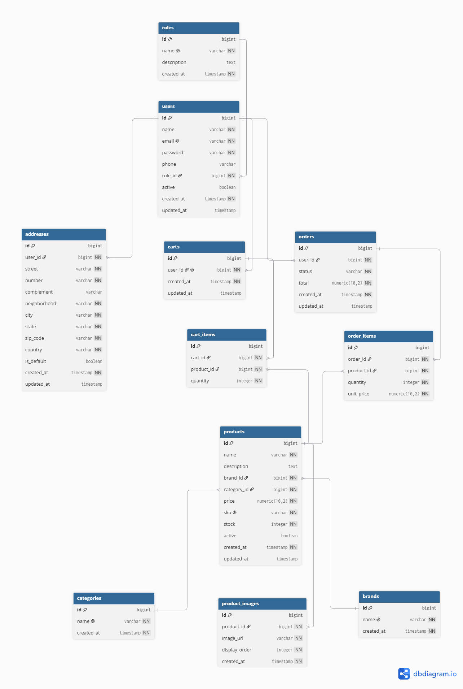

# TechStore

A Full Stack E-commercece project built to study modern backed and frontend development.

## Technologies

- Java 21
- Spring Boot
- Spring Data JPA
- PostgreeSql
- Docker
- React
- Fresh
- Tailwind CSS

---

## Database Architecture

The project follows a normalized relational datavase model.

---

## Main Entities

- Users
- Roles 
- Products
- Product Images
- Categories
- Brands
- Shopping Cart
- Orders
- Addresses

---

## Planned Features

- User Authentication (JWT)
- Product Catalog
- Product Search
- Shopping Cart
- Checkout
- Order History
- Admin Dashboard
