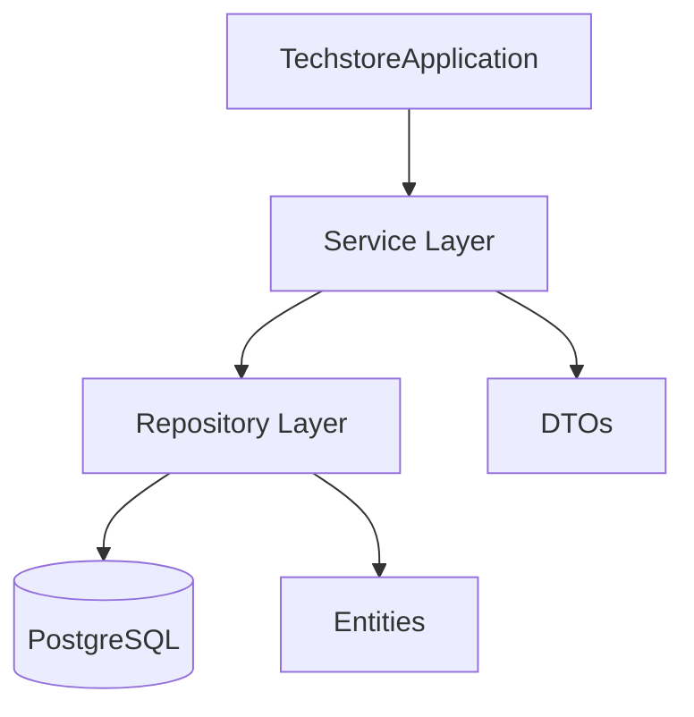

# PROJECT_CONTEXT

## 1. Project Overview

### Project Name

`TechStore`

### Purpose

TechStore is a personal full-stack e-commerce project created to study professional backend development with Java and Spring Boot. This purpose is stated in the repository documentation, especially [docs/01-project-overview.md](/C:/javaprojects/techstore/docs/01-project-overview.md) and [README.MD](/C:/javaprojects/techstore/README.MD).

### Business Idea

The repository models an online store domain with users, roles, addresses, products, brands, categories, product images, shopping carts, cart items, orders, order items, and order shipping addresses. The business idea currently represented in code is a catalog-and-order e-commerce backend.

### Long-Term Vision

The documented long-term direction includes:

- Production-style REST API
- Authentication with JWT
- Testing
- Docker usage
- Cloud deployment
- CI/CD

These goals are documented in [docs/01-project-overview.md](/C:/javaprojects/techstore/docs/01-project-overview.md), [docs/05-roadmap.md](/C:/javaprojects/techstore/docs/05-roadmap.md), and [README.MD](/C:/javaprojects/techstore/README.MD).

### Current Maturity Level

Current maturity level: `Early-stage backend foundation`

Evidence:

- Domain entities are implemented.
- Several repositories are implemented.
- One service slice exists for categories.
- No controllers are implemented.
- No security, exception handling, validation layer, or production deployment setup is implemented.

## 2. Learning Objectives

This project exists as a learning vehicle for backend and software engineering practice.

Documented learning goals include:

- Improve Java and Spring Boot skills
- Practice relational database modeling
- Apply object-oriented design principles
- Build a production-style REST API
- Learn modern backend architecture
- Create a portfolio-quality project

The repository also indicates an intention to study:

- Spring Data JPA
- REST APIs
- Authentication
- Testing
- Docker
- Cloud deployment

These goals are explicitly documented in [docs/01-project-overview.md](/C:/javaprojects/techstore/docs/01-project-overview.md) and partially reflected in the current source structure.

Expected evolution, based on existing documentation:

- From domain model to persistence
- From persistence to business layer
- From business layer to API
- From API to security, testing, and infrastructure

This sequence is described in [docs/05-roadmap.md](/C:/javaprojects/techstore/docs/05-roadmap.md).

## 3. Project Scope

### Included Features

Features currently modeled or partially implemented in the repository:

- User and role domain model
- Address domain model
- Product catalog domain model
- Brand and category domain model
- Product images domain model
- Shopping cart domain model
- Order domain model
- PostgreSQL schema definition
- Category creation service slice

### Excluded Features

The repository does not currently implement the following:

- Frontend application code
- Authentication flow
- Authorization rules
- Payment integration
- Admin dashboard
- External API integrations
- Monitoring stack
- CI/CD pipeline configuration

Where exclusion is intentional versus simply not yet started is not always explicit. When not documented as intentionally excluded, these items should be read as `Not yet implemented`.

### Future Features

Future features explicitly listed in repository documentation:

- User Authentication (JWT)
- Product Catalog
- Product Search
- Shopping Cart
- Checkout
- Order History
- Admin Dashboard
- Wishlist
- Product Reviews
- Discount Coupons
- Payment Integration
- Shipment Tracking
- Inventory Reservation
- Email Notifications
- Remarketing Campaigns

Source: [README.MD](/C:/javaprojects/techstore/README.MD) and [docs/05-roadmap.md](/C:/javaprojects/techstore/docs/05-roadmap.md)

## 4. Technology Stack

Only technologies present in the repository are listed here.

| Technology | How it is used | Why it appears to have been chosen | Status |
|---|---|---|---|
| Java 21 | Source language configured in `pom.xml` | Modern Java version explicitly configured by the project | Implemented |
| Spring Boot | Application framework and bootstrap class | Core framework for backend development | Implemented |
| Spring Web MVC | Declared dependency for HTTP API support | Planned web/API layer support | Dependency present, controllers not yet implemented |
| Spring Data JPA | Declared dependency and repository model | Persistence abstraction over JPA/Hibernate | Implemented |
| Hibernate | JPA provider used through Spring Data JPA and Hibernate annotations | ORM and automatic persistence mapping | Implemented |
| PostgreSQL | Configured datasource and Docker service | Relational database for the project | Implemented as external dependency |
| Maven | Build tool via `pom.xml` and Maven wrapper | Standard Java/Spring build automation | Implemented |
| Maven Wrapper | `mvnw`, `mvnw.cmd`, `.mvn/wrapper` | Consistent Maven execution across environments | Implemented |
| Lombok | Used in entities and configured as annotation processor | Reduce boilerplate for getters/setters/constructors | Implemented |
| Docker Compose | `docker-compose.yml` for PostgreSQL service | Local development database orchestration | Implemented |
| SQL initialization scripts | `schema.sql` and `data.sql` | Initialize database schema directly from the application | Implemented |
| JUnit 5 | Present through Spring Boot test support | Test execution foundation | Implemented |
| Spring Boot test support | `@SpringBootTest` in test class | Application context testing | Implemented |

Technologies mentioned in documentation but not implemented in source:

- React
- Fresh
- Tailwind CSS
- Spring Security
- JWT
- Azure
- CI/CD
- Testcontainers

These are `Planned` or `Mentioned in documentation only`, depending on the specific file.

## 5. Architecture Overview

### Architecture Style

The project documents a layered architecture:

`Controller -> Service -> Repository -> Database`

Source: [docs/02-architecture.md](/C:/javaprojects/techstore/docs/02-architecture.md)

The actual source tree currently contains packages for:

- `controller`
- `dto`
- `entity`
- `repository`
- `service`

The `controller` package exists but currently has no classes.

### Package Organization

- `com.fragala.techstore`
  - application bootstrap
- `com.fragala.techstore.controller`
  - intended API layer, currently empty
- `com.fragala.techstore.dto.request`
  - request DTOs
- `com.fragala.techstore.dto.response`
  - response DTOs
- `com.fragala.techstore.entity`
  - JPA domain model
- `com.fragala.techstore.repository`
  - Spring Data repositories
- `com.fragala.techstore.service`
  - business layer

### Layer Responsibilities

Current documented responsibilities:

- Controller: handle HTTP requests and responses
- Service: business workflows and rules
- Repository: persistence access
- Entity: domain representation and relationships

These responsibilities are documented in [docs/02-architecture.md](/C:/javaprojects/techstore/docs/02-architecture.md).

### Dependency Flow

Current intended dependency flow:

`controller -> service -> repository -> database`

Current actual flow visible in code:

`CategoryService -> CategoryRepository -> Category entity`

The project does not currently contain controller-to-service usage because controllers have not been implemented.

### Project Conventions

Conventions explicitly visible in the repository:

- Domain-first modeling
- JPA entity relationships use object references instead of foreign key ID primitives
- Constructor injection is used in `CategoryService`
- Repositories extend `JpaRepository`
- DTO separation exists for the category slice
- Business methods exist on some entities
- SQL schema is managed through `schema.sql`

Documented architectural decisions exist in [docs/06-decisions.md](/C:/javaprojects/techstore/docs/06-decisions.md).

## 6. Domain Model

### Role

- Purpose: represent a user role
- Relationships: one role to many users
- Business rules:
  - every user must have exactly one role
- Current implementation status:
  - Entity implemented
  - Repository not implemented
  - Service not implemented
  - Controller not implemented

Notes:

- `schema.sql` contains a `description` column for `roles`
- `Role` entity does not currently map a `description` field

### User

- Purpose: represent a registered user/customer
- Relationships:
  - many users to one role
  - one user to one cart
  - one user to many addresses
  - one user to many orders
- Business rules:
  - unique email
  - password must be stored encrypted
  - user is active by default
- Current implementation status:
  - Entity implemented
  - Repository implemented
  - Service class exists but is empty
  - Controller not implemented

### Address

- Purpose: represent a user shipping address
- Relationships:
  - many addresses to one user
- Business rules:
  - user can have multiple addresses
  - at most one default address per user
- Current implementation status:
  - Entity implemented
  - Repository not implemented
  - Service not implemented
  - Controller not implemented

### Brand

- Purpose: represent the manufacturer or brand of a product
- Relationships:
  - one brand to many products
- Business rules:
  - none beyond uniqueness of name visible in schema/entity
- Current implementation status:
  - Entity implemented
  - Repository implemented
  - Service not implemented
  - Controller not implemented

### Category

- Purpose: organize products into categories
- Relationships:
  - one category to many products
- Business rules:
  - unique name
- Current implementation status:
  - Entity implemented
  - Repository implemented
  - DTOs implemented
  - `CategoryService.create(...)` implemented
  - Controller not implemented

### Product

- Purpose: represent a sellable catalog item
- Relationships:
  - many products to one brand
  - many products to one category
  - one product to many product images
- Business rules:
  - unique SKU
  - price must be non-negative
  - stock must be non-negative
  - inactive products cannot be purchased
- Current implementation status:
  - Entity implemented
  - Repository implemented
  - Service not implemented
  - Controller not implemented

### ProductImage

- Purpose: represent an image associated with a product
- Relationships:
  - many product images to one product
- Business rules:
  - multiple images allowed
  - ordered display using `displayOrder`
- Current implementation status:
  - Entity implemented
  - Repository not implemented
  - Service not implemented
  - Controller not implemented

### Cart

- Purpose: represent the active shopping cart of a user
- Relationships:
  - one cart to one user
  - one cart to many cart items
- Business rules:
  - every user has one active shopping cart
  - cart items belong to a cart
- Current implementation status:
  - Entity implemented
  - Repository implemented
  - Service not implemented
  - Controller not implemented

### CartItem

- Purpose: represent a line inside a shopping cart
- Relationships:
  - many cart items to one cart
  - many cart items to one product
- Business rules:
  - quantity must be greater than zero
  - same product should not appear twice in the same cart
  - cart pricing is dynamic and uses current product price
- Current implementation status:
  - Entity implemented
  - Repository not implemented
  - Service not implemented
  - Controller not implemented

### Order

- Purpose: represent a completed purchase
- Relationships:
  - many orders to one user
  - one order to many order items
  - one order to one order shipping address
- Business rules:
  - total must be non-negative
  - status must be one of `PENDING`, `PAID`, `SHIPPED`, `DELIVERED`, `CANCELLED`
- Current implementation status:
  - Entity implemented
  - Repository implemented
  - Service not implemented
  - Controller not implemented

### OrderItem

- Purpose: represent one purchased product line in an order
- Relationships:
  - many order items to one order
  - many order items to one product
- Business rules:
  - quantity must be positive
  - unit price must be non-negative
  - unit price is preserved at checkout time
- Current implementation status:
  - Entity implemented
  - Repository not implemented
  - Service not implemented
  - Controller not implemented

### OrderShippingAddress

- Purpose: preserve the shipping address snapshot used during checkout
- Relationships:
  - one shipping address snapshot to one order
- Business rules:
  - shipping address remains independent from later edits to user addresses
- Current implementation status:
  - Entity implemented
  - Repository not implemented
  - Service not implemented
  - Controller not implemented

### OrderStatus

- Purpose: enumerate the allowed order states
- Relationships: not applicable
- Business rules:
  - allowed values are fixed in the enum
- Current implementation status:
  - Enum implemented

## 7. Current Repository Structure

### Top-Level Structure

```text
techstore/
├── .mvn/
├── docs/
├── src/
├── target/
├── .gitattributes
├── .gitignore
├── docker-compose.yml
├── HELP.md
├── mvnw
├── mvnw.cmd
├── pom.xml
└── README.MD
```

### Source Structure

```text
src/
├── main/
│   ├── java/com/fragala/techstore/
│   │   ├── controller/
│   │   ├── dto/
│   │   │   ├── request/
│   │   │   └── response/
│   │   ├── entity/
│   │   ├── repository/
│   │   └── service/
│   └── resources/
│       ├── application.properties
│       ├── data.sql
│       └── schema.sql
└── test/
    └── java/com/fragala/techstore/
        └── TechstoreApplicationTests.java
```

### Responsibility of Major Folders

- `.mvn/`: Maven wrapper support files
- `docs/`: project documentation and design notes
- `src/main/java/`: application source code
- `src/main/resources/`: runtime configuration and SQL initialization scripts
- `src/test/java/`: automated tests
- `target/`: generated build output

### Mermaid Diagram



### Documentation Files

- `docs/01-project-overview.md`
- `docs/02-architecture.md`
- `docs/03-domain-model.md`
- `docs/04-business-rules.md`
- `docs/05-roadmap.md`
- `docs/06-decisions.md`
- `docs/database-diagram.png`

## 8. Current Implementation Status

### Implemented

- Spring Boot application bootstrap
- JPA entities for core ecommerce domain
- Repositories:
  - `BrandRepository`
  - `CartRepository`
  - `CategoryRepository`
  - `OrderRepository`
  - `ProductRepository`
  - `UserRepository`
- Category request DTO
- Category response DTO
- Category creation service method
- PostgreSQL schema script
- Docker Compose PostgreSQL service
- Basic Spring Boot context test
- Project documentation set in `docs/`

### Partially Implemented

- Category module
  - entity, repository, DTOs, service method exist
  - controller, validation, tests, and exception handling do not exist
- User module
  - entity and repository exist
  - service class exists but contains no logic
- Layered architecture
  - structure exists
  - only one actual service slice is connected
- Database initialization
  - schema exists
  - `data.sql` exists but is empty

### Planned

Explicitly planned in repository documentation:

- Controllers
- DTOs for additional modules
- Request validation
- API documentation
- Spring Security
- JWT authentication
- Role-based authorization
- Unit tests
- Integration tests
- Testcontainers
- Docker
- CI/CD
- Azure deployment

Source: [docs/05-roadmap.md](/C:/javaprojects/techstore/docs/05-roadmap.md)

### Not Started

Not started in source code:

- Controller implementations
- Security configuration
- Global exception handling
- Validation layer
- Mapper layer
- Transactional workflows for cart/order/checkout
- Payment functionality
- Monitoring
- Deployment automation
- CI/CD pipeline configuration

## 9. Business Rules

This section collects rules already present in repository code or documentation.

### Users

- Every user must have a unique email address.
- Passwords must always be stored encrypted.
- Every user must have exactly one role.
- A newly created user is active by default.

Source: [docs/04-business-rules.md](/C:/javaprojects/techstore/docs/04-business-rules.md)

### Addresses

- A user can have multiple addresses.
- Every address belongs to exactly one user.
- A user can have at most one default address.
- The default address is used during checkout unless another address is selected.

Source: [docs/04-business-rules.md](/C:/javaprojects/techstore/docs/04-business-rules.md) and partial unique index in [src/main/resources/schema.sql](/C:/javaprojects/techstore/src/main/resources/schema.sql)

### Products

- Every product belongs to exactly one brand.
- Every product belongs to exactly one category.
- A product can have multiple images.
- Every product must have a unique SKU.
- Product prices must use decimal precision.
- Products can be activated or deactivated.
- Inactive products cannot be purchased.
- Stock cannot be negative.

Source: [docs/04-business-rules.md](/C:/javaprojects/techstore/docs/04-business-rules.md) and [src/main/resources/schema.sql](/C:/javaprojects/techstore/src/main/resources/schema.sql)

### Inventory

- Stock is reduced only after a successful checkout.
- Stock is increased through inventory operations.

Source: [docs/04-business-rules.md](/C:/javaprojects/techstore/docs/04-business-rules.md)

### Cart

- Every user has one active shopping cart.
- Every shopping cart belongs to exactly one user.
- A cart can contain multiple cart items.
- The same product should not appear twice in the same cart.
- Increasing quantity should update the existing cart item instead of creating another one.
- Item quantity must be greater than zero.
- Cart pricing is dynamic and uses the current `Product.price`.
- Adding a product to the cart does not freeze its price.

Source: [docs/04-business-rules.md](/C:/javaprojects/techstore/docs/04-business-rules.md) and [docs/06-decisions.md](/C:/javaprojects/techstore/docs/06-decisions.md)

### Orders

- Checkout converts the current cart into an order.
- Every order belongs to exactly one user.
- Every order must contain at least one order item.
- Every order must have one shipping-address snapshot copied from the selected user address at checkout.
- The shipping snapshot must remain independent from future edits to the user's address book.
- Order status must be one of `PENDING`, `PAID`, `SHIPPED`, `DELIVERED`, `CANCELLED`.
- The purchase price must be stored at the time of checkout.
- Purchased quantity must be stored.
- Order items become immutable after checkout.

Source: [docs/04-business-rules.md](/C:/javaprojects/techstore/docs/04-business-rules.md)

### Auditing

- Creation timestamps are generated automatically.
- Update timestamps are maintained automatically only for mutable entities.
- Database identifiers are generated automatically.

Source: [docs/04-business-rules.md](/C:/javaprojects/techstore/docs/04-business-rules.md)

## 10. Coding Standards

Only conventions that are visible in the repository are described here.

### Naming Conventions

- Class names use PascalCase.
- Package names use lowercase.
- Repository interfaces use `*Repository`.
- Service classes use `*Service`.
- DTO names use request/response suffixes.

### Package Organization

- Packages are organized by technical layer, not by feature module.

### Constructor Injection

- Constructor injection is used in `CategoryService`.
- It is not yet possible to say this is a project-wide standard because only one implemented service uses dependencies.

### DTO Usage

- DTO separation exists for the category use case.
- It is not yet used consistently across the project.

### Dependency Injection

- Spring component scanning is used.
- `@Service` is currently used in `CategoryService`.

### Repository Pattern

- Spring Data repositories extend `JpaRepository`.
- Repository implementations are not written manually.

### Exception Handling

- No global exception handling approach is implemented yet.

### Validation Approach

- No Bean Validation annotations or explicit validation layer are currently implemented.

### Documentation Style

- The repository includes substantial Markdown documentation in `docs/`.
- Source code includes JavaDoc and inline educational comments in many classes.

### Domain Modeling

- Entities use object references for relationships instead of storing foreign key IDs directly.
- Some entities include domain methods such as `activate()`, `deactivate()`, `changePassword()`, `changeQuantity()`, and `clear()`.

### Unknown or Not Yet Defined

- API versioning strategy: Unknown
- Mapping strategy between entities and DTOs beyond the category slice: Not yet implemented
- Logging convention: Not yet defined
- Exception taxonomy: Not yet defined
- Testing standards beyond context load: Not yet defined

## 11. External Dependencies

### Database

- PostgreSQL
- Configured in [src/main/resources/application.properties](/C:/javaprojects/techstore/src/main/resources/application.properties)
- JDBC URL: `jdbc:postgresql://localhost:5433/techstore`

### Docker Services

`docker-compose.yml` defines one service:

- `postgres`
  - image: `postgres:17`
  - database: `techstore`
  - username: `postgres`
  - password: `postgres`
  - host port: `5433`
  - container port: `5432`

### APIs

- No external APIs are configured in the repository.

### External Services

- No third-party external services are configured in the repository.

### Environment Variables

No `.env` file is committed.

The following environment-sensitive values are visible in committed configuration:

- database URL
- database username
- database password

### Configuration Files

- `pom.xml`: build and dependencies
- `application.properties`: runtime configuration
- `schema.sql`: database schema initialization
- `data.sql`: database data initialization file, currently empty
- `docker-compose.yml`: local PostgreSQL orchestration
- `.gitignore`: ignore patterns
- `.gitattributes`: line-ending rules for wrapper scripts

## 12. Current Technical Debt

### 1. Incomplete vertical slices

- Description: most modules stop at the entity or repository layer
- Impact: the repository structure suggests capability that is not yet usable through an API
- Suggested priority: High

### 2. Entity-to-schema mismatch in `Role`

- Description: `schema.sql` defines `roles.description`, but `Role` entity does not map it
- Impact: the Java model and database model are not fully aligned
- Suggested priority: High

### 3. No controller layer implementation

- Description: controller package exists but is empty
- Impact: no HTTP endpoints are available
- Suggested priority: High

### 4. No validation layer

- Description: request DTOs do not use validation annotations and no validation strategy is present
- Impact: invalid input handling is undefined
- Suggested priority: High

### 5. No global exception handling

- Description: no exception package or shared error response model exists
- Impact: runtime failures would rely on framework defaults
- Suggested priority: High

### 6. Sparse testing

- Description: only one `contextLoads` test exists
- Impact: behavior is largely unverified
- Suggested priority: High

### 7. Test environment coupling

- Description: application startup test depends on PostgreSQL availability at `localhost:5433`
- Impact: tests are not self-contained
- Suggested priority: High

### 8. Inconsistent repository coverage

- Description: several entities have no corresponding repository interfaces
- Impact: persistence layer completeness is uneven
- Suggested priority: Medium

### 9. Empty `data.sql`

- Description: data initialization file exists but currently contains no seed data
- Impact: no sample dataset is available through the built-in initialization path
- Suggested priority: Medium

### 10. README quality issues

- Description: README content is short and contains multiple spelling errors
- Impact: portfolio presentation and onboarding quality are reduced
- Suggested priority: Medium

### 11. Documentation quality inconsistencies

- Description: several docs contain spelling mistakes and encoding artifacts
- Impact: documentation is useful but not yet polished
- Suggested priority: Medium

### 12. Planned technologies listed without implementation

- Description: some technologies are mentioned in docs/README without corresponding source code
- Impact: the repository vision is broader than the current implementation
- Suggested priority: Low

## 13. Current Project Health

### Architecture: Good

The project has a clear layered direction and a coherent domain model. Implementation depth is still shallow, but the structure is understandable.

### Maintainability: Fair

The codebase is small and readable, but many layers are incomplete and conventions are not yet fully established across modules.

### Scalability: Fair

The architecture could scale if consistently applied, but current implementation is too incomplete to assess practical scalability beyond the model level.

### Readability: Good

The code is relatively easy to read, especially after the added JavaDoc and educational comments. Some formatting and spelling inconsistencies remain in documentation and comments.

### Documentation: Good

The repository contains meaningful design and business-rule documentation. It is more documented than typical early-stage personal projects. However, documentation quality is uneven.

### Testing: Poor

Only a single application context test exists, and it depends on an external database being available.

### Deployment Readiness: Poor

There is no application Dockerfile, no production configuration, no security, no deployment pipeline, and no evidence of a deployable packaged environment beyond local database setup.

## 14. Current Development Stage

Development appears to have stopped immediately after beginning the first real vertical application slice.

### Latest Completed Feature

Latest clearly completed feature in source code:

- Category entity
- Category repository
- Category request DTO
- Category response DTO
- Category creation service method

This is the most complete module in the repository.

### Currently In Progress

Based on repository state, the following appears to be in progress:

- Transition from pure domain modeling to application/service layer implementation

Evidence:

- `CategoryService` is implemented
- `UserService` exists but is empty
- `controller` package exists but is empty
- roadmap docs place the project between domain model completion and broader business/API implementation

### What Should Logically Come Next

Without proposing a roadmap, the next logical repository-level step is the completion of the same category vertical slice by adding the missing API layer and related validation/error handling for that existing use case.

## 15. Known Limitations

### Technical Limitations

- No controllers
- No security
- No validation framework usage in DTOs
- No exception handling layer
- No integration testing strategy
- No production deployment setup
- No database migration tool
- No application Dockerfile
- No monitoring or observability setup

### Business Limitations

- No implemented checkout workflow
- No implemented order history API
- No implemented product search API
- No implemented authentication flow
- No implemented payment flow
- No implemented inventory management workflow beyond modeling

### Learning Limitations

- The repository shows early exploration of architecture and domain modeling, but limited examples of:
  - REST controller design
  - validation patterns
  - exception handling patterns
  - test design
  - security implementation
  - deployment workflows

## 16. Future Documentation

These documents do not all exist today. This section only describes useful future documentation artifacts.

### `README.md`

Purpose: concise project entry point, setup steps, architecture summary, and local run instructions.

### `API_GUIDE.md`

Purpose: document endpoints, request/response contracts, status codes, and validation behavior once controllers exist.

### `CONTRIBUTING.md`

Purpose: define contribution workflow, coding conventions, branch strategy, and review expectations.

### `CHANGELOG.md`

Purpose: track meaningful repository changes over time.

### `SECURITY.md`

Purpose: explain authentication, authorization, credential handling, and security assumptions once implemented.

### `TESTING.md`

Purpose: describe testing strategy, test layers, local test execution, and database test setup.

### `DEPLOYMENT.md`

Purpose: document runtime environments, infrastructure assumptions, and deployment steps.

## 17. AI Development Rules

Future AI assistants working on this repository should follow these rules:

- Never skip architectural steps already implied by the repository structure.
- Preserve the current layered architecture unless the user explicitly requests a redesign.
- Base every recommendation on the actual repository state.
- Prefer consistency over cleverness.
- Treat the project as educational as well as functional.
- Explain important design decisions in plain technical language.
- Avoid unnecessary abstractions.
- Keep code readable and straightforward.
- Do not refactor unrelated code during focused tasks.
- Always verify the repository state before suggesting implementation work.
- Do not assume undocumented infrastructure or business requirements exist.
- If something is missing or uncertain, label it as `Unknown` or `Not yet implemented`.
- Prefer constructor injection when adding Spring-managed dependencies, since that pattern already exists in the codebase.
- Respect the current domain-first design direction documented in `docs/06-decisions.md`.

## Last Repository Analysis Summary

Repository analyzed on July 28, 2026.

At the time of analysis, TechStore was an early-stage Spring Boot ecommerce backend with a documented domain model, implemented JPA entities, several Spring Data repositories, one partially completed category service slice, SQL-based PostgreSQL schema initialization, Docker Compose for the database, and minimal automated testing. The repository had not yet implemented controllers, validation, exception handling, security, or end-to-end business workflows.
